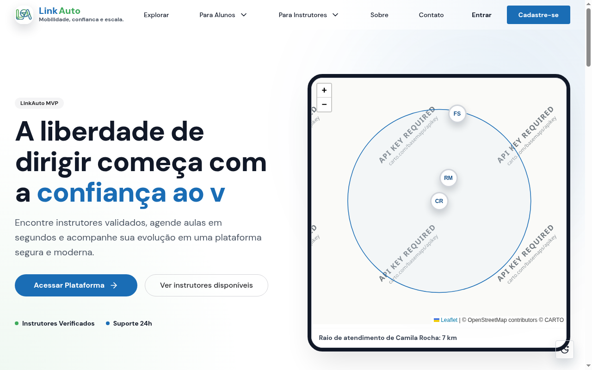
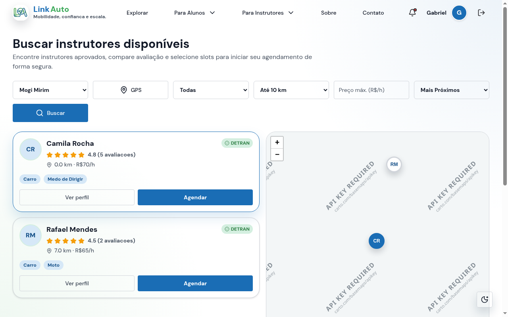
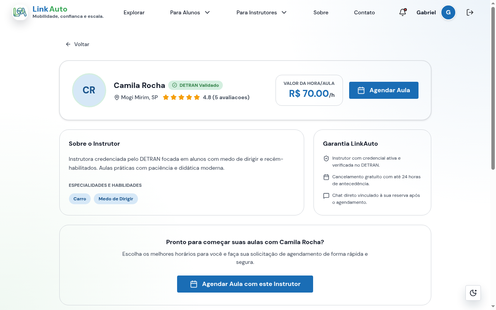
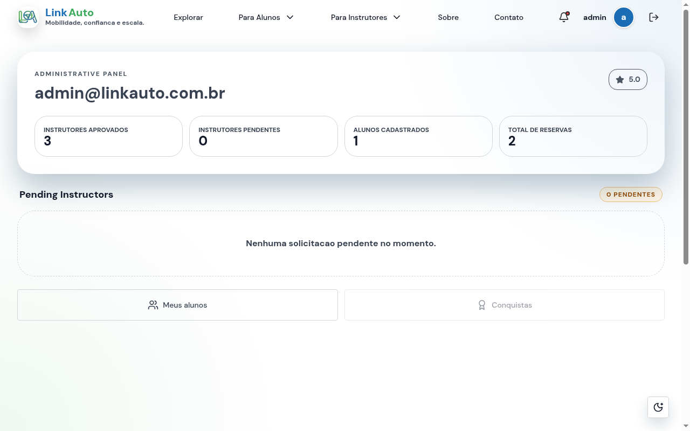

# LinkAuto 🚗💨

Plataforma mobile-first para conectar alunos e instrutores autônomos de trânsito credenciados pelo DETRAN.

Idiomas:
- 🇧🇷 **PT-BR:** [README.md](README.md)
- 🇺🇸 **US-EN:** [docs/README.en.md](docs/README.en.md)

Navegação rápida:
- [Visão Geral](#visao-geral)
- [Demonstração Visual](#demonstracao-visual)
- [Status do Projeto](#status-do-projeto)
- [Endpoints Operacionais](#endpoints-operacionais-da-api)
- [Arquitetura e Stack](#arquitetura-e-stack)
- [Como Executar](#como-executar-localmente)
- [Qualidade e Testes](#qualidade-e-testes)
- [Segurança & LGPD](docs/SECURITY_TECHNIQUES.md)


---

## Visão Geral

O **LinkAuto** é uma plataforma inovadora que organiza o fluxo de descoberta geolocalizada de instrutores de direção, credenciamento administrativo pelo DETRAN, perfis públicos com blindagem LGPD, agendamento de aulas com regras de negócio seguras e avaliações mútuas de reputação.

### Escopo Consolidado
- **Usuários Multi-Role:** Perfis de `ALUNO`, `INSTRUTOR` e `ADMIN`.
- **Autenticação Segura:** JWT de curta duração com renovação silenciosa via `refresh_token` em cookies `HttpOnly` seguros.
- **Validação de Credenciamento DETRAN (RN01):** Moderação manual pelo Administrador e envio de documentos com validação por Magic Bytes.
- **Perfis Públicos Anônimos (LGPD / RNF03):** Acesso a perfis por **slugs seguros** (ex: `/instructors/carlos-silva-mogi-mirim-8f2a`), blindando 100% dos UUIDs internos e dados pessoais (PII).
- **Agendamento Inteligente (RN02-RN04):** Slots de 1 hora, agendamento mínimo de 2 horas consecutivas, máquina de estados e penalidade de 7 dias para cancelamentos com menos de 24h.
- **Avaliações Mútuas & Fórum de Mensagens:** Histórico de conversas por agendamento e avaliações de 1 a 5 estrelas com recálculo automático de reputação do instrutor.
- **Dashboards em Tempo Real:** Painéis analíticos com métricas operacionais para administradores e instrutores.

### Documentação Canônica (Single Source of Truth)
- 📜 **Requisitos e Regras de Negócio:** [`docs/requirements.md`](docs/requirements.md)
- 🏛️ **Diagramas de Classe do Banco de Dados:** [`docs/DATABASE_CLASS_DIAGRAMS.md`](docs/DATABASE_CLASS_DIAGRAMS.md)
- 🎨 **Design System e Padrões de Interface:** [`docs/DESIGN.md`](docs/DESIGN.md)
- 🔌 **Especificações de Endpoints da API:** [`docs/BACKEND_ENDPOINT_REQUESTS.md`](docs/BACKEND_ENDPOINT_REQUESTS.md)
- 🛡️ **Técnicas de Segurança e Hardening:** [`docs/SECURITY_TECHNIQUES.md`](docs/SECURITY_TECHNIQUES.md) e [`docs/SECURITY_COMPARISON.md`](docs/SECURITY_COMPARISON.md)
- 📖 **Documentação Interativa Swagger:** [http://localhost:8000/docs](http://localhost:8000/docs) (OpenAPI em `/openapi.json`)

---

## Demonstração Visual

Abaixo, algumas das principais interfaces do LinkAuto em operação:

| Landing Page (Hero & Demonstração) | Busca Geolocalizada com Leaflet |
| :---: | :---: |
|  |  |

| Perfil Público do Instrutor (Slug & LGPD) | Painel de Gestão & Estatísticas |
| :---: | :---: |
|  |  |

---

## Status do Projeto

### Progresso por Fase

| Fase | Estado | Cobertura & Destaques |
| :--- | :---: | :--- |
| **Phase 1 - Setup** | Concluída | FastAPI, envelopes comuns, Docker Compose inicial |
| **Phase 2 - Foundational** | Concluída | JWT access/refresh, SQLite dev, máquina de estados base |
| **Phase 3 - US1** | Concluída | Cadastro, login, upload de documentos e aprovação Admin |
| **Phase 4 - US2** | Concluída | Slots de 1h, agendamentos consecutivos (min 2h), penalidades RN04 |
| **Phase 5 - US3** | Concluída | Mensagens por agendamento, reviews mútuas, lembrete 24h e 8 e-mails SES |
| **Phase 6 - Polish & Hardening** | Concluída | Rate limit SlowAPI, security headers, magic bytes, fail-fast e correlation IDs |
| **Phase 7 - Frontend Integration** | Concluída | Conexão 100% com API real, geolocalização com fallback, 97 testes Vitest verdes |
| **Phase 8 - Tooling & Stack Integration** | Concluída | Migração para `uv`, `SQLModel 0.0.48`, typechecker `ty`, Alembic baseline e workspace multi-root |

### Resumo de Validação
- 🟢 **Backend:** **236 testes verdes** no Pytest, 0 erros no `ty check`, 0 avisos no `ruff check` (regras `ALL`).
- 🟢 **Frontend:** **102 testes verdes** no Vitest, 0 erros no TypeScript (`npm run typecheck` estrito).

---

## Endpoints Operacionais da API

Todos os endpoints estão implementados e disponíveis com contratos estritos validados:

- **Infraestrutura:**
  - `GET /health` — Verificação de saúde da API
  - `GET /api/v1/foundation/ping` — Ping de latência
- **Autenticação:**
  - `POST /api/v1/auth/register` — Cadastro de alunos e instrutores (bloqueio de role ADMIN pública)
  - `POST /api/v1/auth/login` — Autenticação com rate limiting e emissão de tokens
  - `POST /api/v1/auth/refresh` — Rotação de refresh token de uso único, com detecção de reuso
  - `POST /api/v1/auth/logout` — Revoga o refresh token da sessão e apaga o cookie
  - `POST /api/v1/auth/password-reset` — Solicitação de recuperação de senha
- **Usuários & Perfis Privados:**
  - `GET /api/v1/users/me` — Dados do usuário logado
  - `PATCH /api/v1/users/me` — Atualização de perfil blindada contra Mass Assignment
- **Perfis Públicos (LGPD & Slugs Amigáveis):**
  - `GET /api/v1/instructors/{slug}/public` — Perfil anônimo com bio, avaliações e selo DETRAN (404 se inativo)
  - `GET /api/v1/students/{slug}/public` — Perfil anônimo do aluno com reputação e histórico
- **Busca Geolocalizada Avançada:**
  - `GET /api/v1/instructors/search` — Busca por Haversine com filtros por especialidade e ordenação
- **Slots & Agenda:**
  - `GET /api/v1/slots` — Listagem de slots disponíveis
  - `POST /api/v1/slots` — Criação de slots de exatamente 1h pelo instrutor
  - `DELETE /api/v1/slots/{id}` — Remoção segura de slot não reservado
- **Agendamentos (Bookings):**
  - `GET /api/v1/bookings` — Minhas aulas (aluno ou instrutor)
  - `POST /api/v1/bookings` — Solicitação atômica (mínimo 2 slots consecutivos)
  - `PATCH /api/v1/bookings/{id}/cancel` — Cancelamento com regra de 24h e suspensão automática RN04
- **Mensagens & Avaliações:**
  - `GET /api/v1/bookings/{id}/messages` — Chat do agendamento
  - `POST /api/v1/bookings/{id}/messages` — Envio de mensagem com notificação de email
  - `POST /api/v1/bookings/{id}/reviews` — Avaliação mútua liberada apenas para aulas REALIZADAS
- **Painel Administrativo & Estatísticas:**
  - `GET /api/v1/admin/stats` — Métricas globais (instrutores, alunos, reservas)
  - `GET /api/v1/instructor/stats` — Métricas individuais do instrutor (horas, aulas, alunos)
  - `GET /api/v1/admin/instructors/pending` — Fila de credenciamentos pendentes
  - `POST /api/v1/admin/instructors/{id}/approve` — Aprovação de instrutor
  - `POST /api/v1/admin/instructors/{id}/reject` — Rejeição fundamentada
- **Automação & Jobs:**
  - `POST /api/v1/jobs/booking-reminder` — Disparo de lembretes 24h antes da aula
  - `POST /api/v1/jobs/booking-timeout` — Cancelamento automático de reservas pendentes há >24h
  - `POST /api/v1/jobs/booking-completion` — Conclusão automática de aulas 2h após o término

---

## Arquitetura e Stack

```text
.
├── LinkAuto-APP.code-workspace  # Workspace multi-root com tooling integrado para VS Code
├── docs/                        # Documentação canônica (Requisitos, Design, Endpoints, Segurança)
│   ├── archive/                 # Registros históricos e rascunhos de iterações anteriores
│   └── images/                  # Identidade visual e capturas de tela do showcase
├── infra/                       # Docker Compose e Dockerfiles multi-stage de desenvolvimento
├── linkauto-backend/            # API FastAPI (SQLModel 0.0.48, uv, ty, Alembic, SQLite/PostgreSQL)
└── linkauto-frontend/           # SPA React 19 (Vite, Chakra UI v3, Tailwind CSS 4, Vitest)
```

- **Frontend:** React 19.2, Vite, Tailwind CSS 4, Chakra UI v3, React Router DOM 7, Leaflet, Vitest.
- **Backend:** Python 3.14 (gerenciado por `uv`), FastAPI, SQLModel 0.0.48, Alembic, Pydantic v2, psycopg 3, Ruff, ty.
- **Banco de Dados:** SQLite com auto-seed no ambiente de desenvolvimento; PostgreSQL + PostGIS em produção.
- **Serviços Cloud:** AWS S3 (armazenamento temporário de credenciais) e AWS SES (notificações por e-mail).

---

## Como Executar Localmente

### Opção A: Docker Compose (Recomendada) 🐳

Para iniciar todo o ecossistema (Backend, Frontend e Banco) em segundo plano:

```bash
docker compose -f infra/docker-compose.yml up -d
```

> [!TIP]
> Para o guia detalhado de comandos Docker, resolução de problemas e testes via container, consulte o **[Guia de Infraestrutura & Docker (infra/README.md)](infra/README.md)**.

Serviços disponíveis:
- 🌐 **Frontend (Web App):** [http://localhost:5173](http://localhost:5173)
- 🔌 **Backend API (Swagger Docs):** [http://localhost:8000/docs](http://localhost:8000/docs)
- 🩺 **Healthcheck da API:** [http://localhost:8000/health](http://localhost:8000/health)

Credenciais de desenvolvimento pré-semeadas:
- **Aluno:** `aluno@linkauto.com.br` / `password123` (Slug: `gabriel-silva-mogi-mirim-1a2b`)
- **Instrutor:** `camila@linkauto.com.br` / `password123` (Slug: `camila-rocha-mogi-mirim-8f2a`)
- **Admin:** `admin@linkauto.com.br` / `password123`

---

### Opção B: Ambiente Nativo

#### 1. Backend (`linkauto-backend`)
Requer [uv](https://docs.astral.sh/uv/) instalado:

```bash
cd linkauto-backend
uv sync                                            # Cria o .venv e instala dependências exatas
uv run uvicorn app.main:app --reload --port 8000   # Inicia a API com hot-reload
```

#### 2. Frontend (`linkauto-frontend`)
Requer Node.js 20+:

```bash
cd linkauto-frontend
npm install
npm run dev
```

#### 3. Desenvolvimento no VS Code
Abra o arquivo [`LinkAuto-APP.code-workspace`](LinkAuto-APP.code-workspace) para que o VS Code utilize automaticamente o interpretador Python do `uv`, o formatador Ruff e o servidor de linguagem `ty` para o backend, juntamente com o tooling do Node.js para o frontend.

---

## Qualidade e Testes

### Backend (`linkauto-backend`)
```bash
cd linkauto-backend
uv run ty check              # Verificação estrita de tipos estáticos
uv run ruff check .          # Linting com todas as regras Ruff habilitadas
uv run ruff format --check . # Verificação de formatação de código
uv run pytest                # Execução dos 236 testes unitários, de contrato e integração
```

### Frontend (`linkauto-frontend`)
```bash
cd linkauto-frontend
npm run typecheck            # Compilação estrita TypeScript (exactOptionalPropertyTypes)
npm run lint                 # Análise estática com ESLint
npm run test                 # Execução dos 102 testes automatizados com Vitest
```

### Integração Contínua (GitHub Actions)
Cada pull request e cada push em `main` executam os workflows em [`.github/workflows/`](.github/workflows/):

- **Backend** (`backend.yml`): `uv sync --locked`, Ruff (lint e formatação), ty, pytest, `alembic upgrade head` + `alembic check` em um SQLite novo, e um job que aplica, verifica e reverte as migrações em um container `postgis/postgis:16-3.4-alpine`.
- **Frontend** (`frontend.yml`): `npm ci`, ESLint, TypeScript, Vitest e build do Vite.

Os jobs só rodam quando o respectivo app muda, mas os checks agregadores **`Backend OK`** e **`Frontend OK`** sempre reportam um status. Configure esses dois como *required status checks* na proteção da branch `main` (Settings → Branches); em PRs empilhados cada camada roda os checks contra a sua base.

### Testes E2E e Validação Visual
Os testes de interface e jornada do usuário são conduzidos nativamente através do **Chrome DevTools MCP** (`@browser-testing-with-devtools`), permitindo capturas em alta resolução, inspeção de DOM e validação de contratos em tempo de execução.
