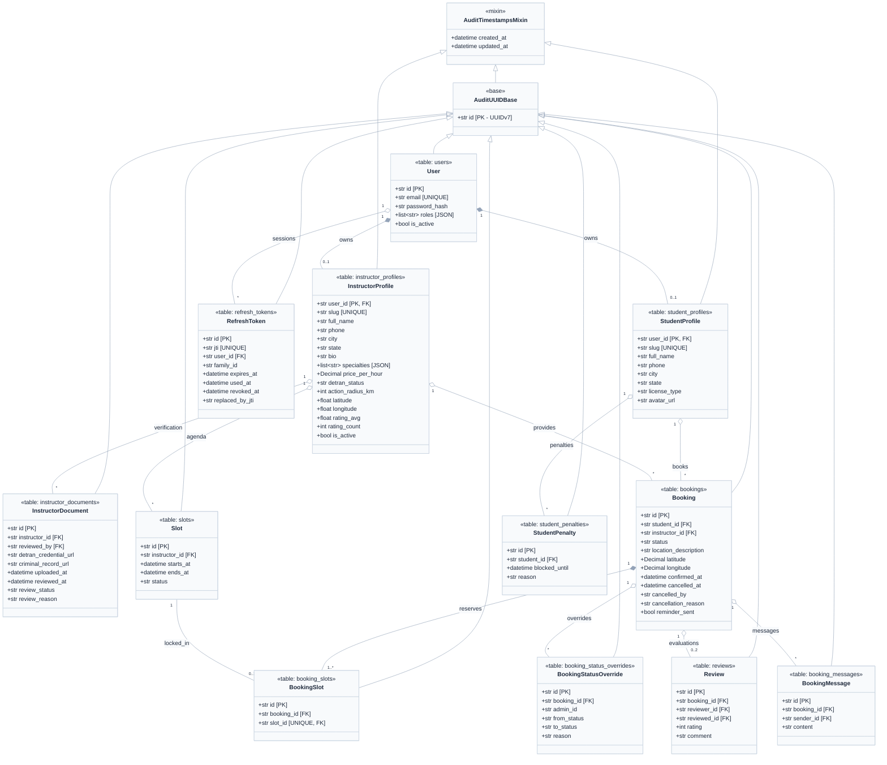

# 🏛️ LinkAuto — Diagramas de Classe dos Schemas de Banco de Dados

> Documento canônico de arquitetura dos modelos de dados e persistência do LinkAuto.  
> **ORM & Framework:** SQLModel 0.0.48 / SQLAlchemy 2.0  
> **Chaves Primárias & Auditoria:** UUIDv7 em string (36 caracteres) e timestamps UTC automáticos.  
> **Bancos Homologados:** SQLite em desenvolvimento/testes automatizados e PostgreSQL + PostGIS em produção.

---

## 📑 Sumário

1. [Padrões Arquiteturais de Persistência](#1-padrões-arquiteturais-de-persistência)
2. [Diagrama 1: Visão Geral de Entidades e Relacionamentos](#2-diagrama-1-visão-geral-de-entidades-e-relacionamentos)
3. [Diagrama 2: Domínio de Identidade & Perfis](#3-diagrama-2-domínio-de-identidade--perfis)
4. [Diagrama 3: Domínio de Agendamentos & Agenda de Slots](#4-diagrama-3-domínio-de-agendamentos--agenda-de-slots)
5. [Diagrama 4: Domínio de Governança, Comunicação & Reputação](#5-diagrama-4-domínio-de-governança-comunicação--reputação)
6. [Instruções de Manutenção e Compilação (Mermaid Studio)](#6-instruções-de-manutenção-e-compilação-mermaid-studio)

---

## 1. Padrões Arquiteturais de Persistência

Os modelos do LinkAuto residem no pacote [`linkauto-backend/app/models/`](../linkauto-backend/app/models/) e seguem os princípios:

- **Herança Base (`base.py`):**
  - `AuditTimestampsMixin`: Colunas não nulas `created_at` e `updated_at` com fuso horário UTC obrigatório.
  - `AuditUUIDBase`: Herda de `AuditTimestampsMixin` e introduz chave primária `id: str` gerada via `generate_uuid7()` (UUIDv7 ordenável no tempo, com fallback seguro para UUIDv4).
- **Tipagem Estrita Python & SQL:** Tipos primitivos tipados nativamente via Pydantic/SQLModel (`str`, `int`, `float`, `Decimal`, `bool`, `datetime`) e convertidos com fidelidade para colunas relacionais.
- **Blindagem LGPD & Slugs Públicos:** Os perfis de aluno e instrutor possuem a coluna `slug` única e indexada para permitir navegação pública sem vazar ou expor UUIDs de identificação do sistema.

---

## 2. Diagrama 1: Visão Geral de Entidades e Relacionamentos

Visão macro da estrutura de herança das entidades e os vínculos relacionais entre todas as 11 tabelas do sistema.



### Código Mermaid (.mmd)



---

## 3. Diagrama 2: Domínio de Identidade & Perfis

Representa a camada de autenticação, contas, rotação de refresh tokens JWT, perfis especializados e conformidade regulatória (DETRAN).



### Classes e Enums do Domínio

| Entidade / Enum | Arquivo Fonte | Responsabilidade |
|---|---|---|
| `User` | [`user.py`](../linkauto-backend/app/models/user.py) | Conta base com credenciais criptografadas (bcrypt), email único e lista de papéis (roles). |
| `StudentProfile` | [`user.py`](../linkauto-backend/app/models/user.py) | Perfil do aluno, categoria de CNH de interesse e slug público de reputação. |
| `InstructorProfile` | [`user.py`](../linkauto-backend/app/models/user.py) | Perfil do instrutor com dados geográficos, valor hora/aula, raio de atuação e status DETRAN. |
| `RefreshToken` | [`refresh_token.py`](../linkauto-backend/app/models/refresh_token.py) | Tokens de renovação com rotação estrita e detecção de reutilização por `family_id`. |
| `InstructorDocument` | [`instructor_document.py`](../linkauto-backend/app/models/instructor_document.py) | Documentos comprobatórios (credencial DETRAN e antecedentes) validados pelo administrador (RN01). |
| `UserRole` | [`user.py`](../linkauto-backend/app/models/user.py) | Enum de papéis: `ALUNO`, `INSTRUTOR`, `ADMIN`. |
| `LicenseType` | [`user.py`](../linkauto-backend/app/models/user.py) | Categorias de habilitação: `NENHUMA`, `A`, `B`, `AB`, `C`, `D`, `E`, `EM_PROCESSO`. |
| `DetranStatus` | [`user.py`](../linkauto-backend/app/models/user.py) | Estados de homologação de credencial: `PENDENTE`, `APROVADO`, `REJEITADO`. |

---

## 4. Diagrama 3: Domínio de Agendamentos & Agenda de Slots

Representa a máquina de estados das aulas, amarração de blocos de agenda, bloqueio de horários e regras disciplinares.



### Regras de Negócio Implementadas

1. **Grade de Horários (`Slot`):** Slots individuais representam blocos indivisíveis de 1 hora.
2. **Reserva Mínima (RN03):** Cada agendamento (`Booking`) deve conter no mínimo 2 slots contíguos (2 horas consecutivas).
3. **Bloqueio e Unicidade (`BookingSlot`):** A tabela associativa possui restrição `UNIQUE(slot_id)`, impedindo matematicamente qualquer condição de corrida ou reserva duplicada do mesmo horário.
4. **Política de Cancelamento e Penalidade (RN04):**
   - Cancelamento permitido com antecedência mínima de 24 horas.
   - Cancelamentos com menos de 24 horas geram registro em `StudentPenalty`, bloqueando o aluno de novos agendamentos por 7 dias (`blocked_until`).
5. **Trilha de Auditoria (`BookingStatusOverride`):** Modificações forçadas por administradores registram o estado anterior, novo estado e justificativa.

---

## 5. Diagrama 4: Domínio de Governança, Comunicação & Reputação

Representa os canais de interação assíncrona entre as partes de uma reserva e o sistema de avaliação mútua e reputação.



### Integridade e Blindagem

- **Mensagens (`BookingMessage`):** Restritas às partes participantes de uma reserva confirmada (`booking_id`), com indexação otimizada por `(booking_id, created_at)` para paginação rápida.
- **Avaliações (`Review`):**
  - Avaliação bilateral permitida apenas após a aula atingir o status `REALIZADA`.
  - Garantida por `UniqueConstraint("booking_id", "reviewer_id")`, impedindo que uma mesma parte avalie mais de uma vez a mesma reserva.
  - Nota de 1 a 5 estrelas com recálculo automático de `rating_avg` e `rating_count` no perfil do instrutor.

---

## 6. Instruções de Manutenção e Compilação (Mermaid Studio)

Todos os diagramas foram gerados e validados com as ferramentas do **Mermaid Studio**. Para recompilar ou gerar novas versões após alterações nos modelos:

```bash
# Definir diretório de dependências do Mermaid Studio
export MERMAID_STUDIO_DIR=$HOME/.local/share/mermaid-studio

# Re-renderizar diagramas individuais para SVG
node ~/.gemini/skills/mermaid-studio/scripts/render.mjs \
  --input docs/diagrams/database-overview-class.mmd \
  --output docs/diagrams/database-overview-class.svg

node ~/.gemini/skills/mermaid-studio/scripts/render.mjs \
  --input docs/diagrams/identity-domain-class.mmd \
  --output docs/diagrams/identity-domain-class.svg

node ~/.gemini/skills/mermaid-studio/scripts/render.mjs \
  --input docs/diagrams/booking-domain-class.mmd \
  --output docs/diagrams/booking-domain-class.svg

node ~/.gemini/skills/mermaid-studio/scripts/render.mjs \
  --input docs/diagrams/governance-domain-class.mmd \
  --output docs/diagrams/governance-domain-class.svg
```
